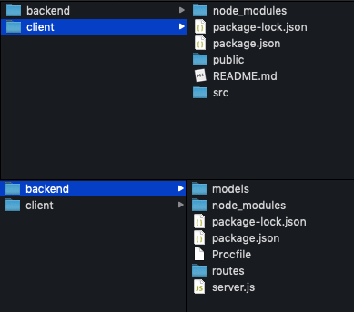

Although our applications run smoothly in the local host, we may have problems deploying to the server and sometimes this situation will may be annoying.

MERN (MongoDB, Express, React, Node.js) stack applications are quite common nowadays. In this article, i will try to explain how our mern stack apps deploy to [Heroku](https://heroku.com).

In every tutorial I've seen, the deployment was described integratedly as frontend and backend and containing a lot of extra codes. But in this article I will show deploying the front and backend separately, and then how to combine.

I have a mern stack [application](https://github.com/tayfurunal/top-10-movies) that you can list and share your 10 favorite movies and I'll use this application throughout the article.

---

##Deploying Backend

Firstly, your project should have two folders that backend(includes *node.js/express*) and client(includes *react*).


 

Then you need to add node version to `engines` in your package.json file. Also there should be a `start` section like `node server.js`

>You can checkout node version on terminal with `node -v`

```json
{
  "name": "node-example",
  "version": "1.0.0",
  "description": "This example is so cool.",
  "main": "web.js",
  "scripts": {
    "start": "node server.js"
  },
  "keywords": [
    "example",
    "heroku"
  ],
  "author": "jane-doe",
  "license": "MIT",
  "dependencies": {
    "express": "^4.9.8"
  },
  "engines": {
    "node": "12.7.0"
  }
}
```

Port configuration must be added to `main/server/app.js` file.

*process.env.PORT is port to use on Heroku*

```js
const PORT = process.env.PORT || 8080;

app.listen(PORT, () => {
  console.log(`Server is running on port ${PORT}`);
});
```

>One of the most important parts is the database. You should use cloud database for live apps. I recommend [Mongo Atlas](https://www.mongodb.com/cloud/atlas). You must change local database uri with cloud database uri on your code.


Let's continue with the `git` part. before starting you must create `.gitignore` file. Those below are enough.

```
/node_modules
npm-debug.log
.DS_Store
/*.env
```

> if you do not have Heroku installed, you have to download it from [Heroku CLI](https://devcenter.heroku.com/articles/heroku-cli#download-and-install) 

After signup/signin [Heroku](https://heroku.com), you'll follow these git commands on your path of the project folder.

```console 
$ git add .
$ git commit -m "deploying project"
$ heroku login
Enter your Heroku credentials.
...
$ heroku create
$ git push heroku master

...
-----> Launching... done
       http://tayfurunal-mern-8408.herokuapp.com deployed to Heroku

```


Backend is done. Now your API is live. We will use `http://tayfurunal-mern-8408.herokuapp.com ` instead of `localhost:8080` for API connection.

---

##Deploying Frontend

First we need to change the parts connected to the backend/API. Remember every place you request API. Like:

```jsx
 axios
      .post('https://localhost:8080/add', {
        sliceMovies,
        userId,
        username
      })
```

to

```jsx
 axios
      .post('https://afternoon-caverns-01522.herokuapp.com/add', {
        sliceMovies,
        userId,
        username
      })
```

After that you'll follow these commands on terminal.

```console
$ cd client
$ git init
$ heroku create -b https://github.com/mars/create-react-app-buildpack.git
$ git add .
$ git commit -m "react-create-app on Heroku"
$ git push heroku master
$ heroku open
```

*And that's all. You can now share your mern stack apps with everyone.*