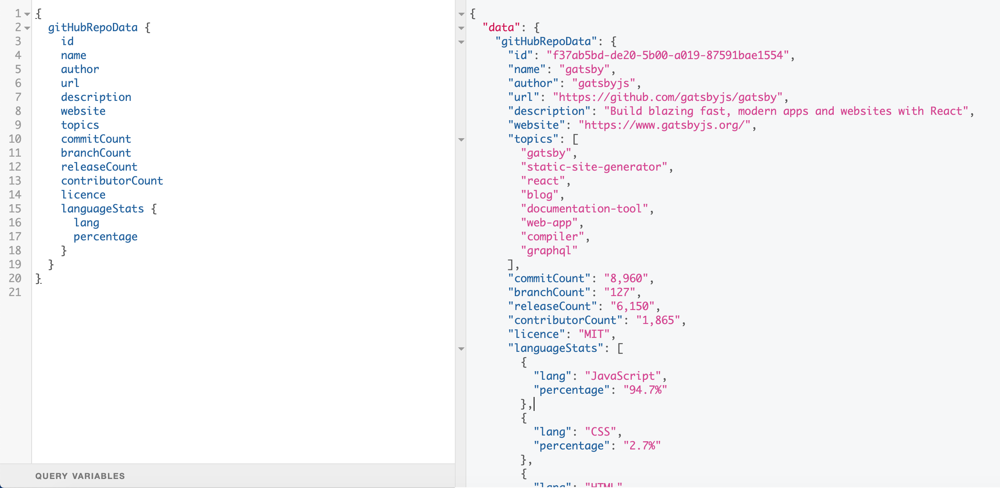
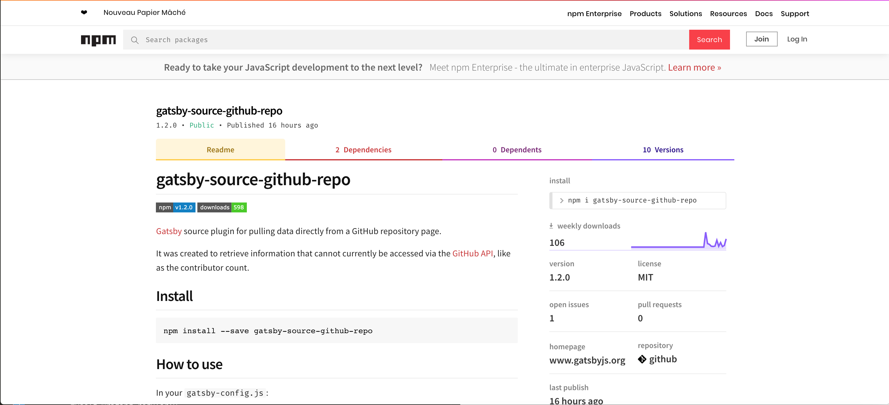

I recently spent some time updating a Gatsby plugin that I had written a few months ago while contributing to the new [Storybook website](https://storybook.js.org/), and I realised that I hadn't yet written about it, or about my experience with the [Gatsby plugin system](https://www.gatsbyjs.org/docs/how-plugins-work/).

Time to change that!

## The Problem

While helping out with the storybook site an issue popped up in which we needed to get a contributor count from GitHub.

We first attempted to fetch the data from the [GitHub API](https://developer.github.com/v3/) but we found that the [Contributors endpoint](https://developer.github.com/v3/repos/#list-contributors) responds with paginated data, showing 30 contributors at a time, with no way to get the total count:

https://api.github.com/repos/storybooks/storybook/contributors

We then tried to use [this trick](https://stackoverflow.com/questions/44347339/github-api-how-efficiently-get-the-total-contributors-amount-per-repository), where you ask for one contributor per page and count the number of pages. But the pagination maxed out at 399, preventing us from getting an accurate count.

We eventually came to the idea of scraping the data from the GitHub repo page itself, as a pre-build step.

I created a script using [node-fetch](https://www.npmjs.com/package/node-fetch) and [Cheerio](https://cheerio.js.org/) that lifted and parsed the HTML body of the repo. This script provided the value directly from the contributor count link, and wrote it into the projects `package.json`, as an [npm config variable](https://docs.npmjs.com/files/package.json#config) called `contributors`:


```javascript
const fs = require('fs');
const fetch = require('node-fetch');
const cheerio = require('cheerio');

const PACKAGE = require('./package');

const repoURL = 'https://github.com/storybooks/storybook';

const getContributorCount = async () => {
  await fetch(repoURL)
    .then(res => res.text())
    .then(body => {
      const $ = cheerio.load(body);
      const count = $('a[href="/storybooks/storybook/graphs/contributors"] > span').html().trim();
      const packageJson = {...PACKAGE, config: { contributors: count }
      fs.writeFile('package.json', JSON.stringify(packageJson}, null, 2), (err) => {
        if(err) {
            return console.error(err);
        }
        console.log('New contributor count added to package.json: ${count} contributors!');
     }); 
    });
};

getContributorCount();
```

With this config variable, we could fetch the value using either `process.env.npm_package_config_contributors` or by pulling it from the `package.json` directly via import.

This worked great locally but had some drawbacks.

- Having a pre-build step isn't an ideal way to handle data fetching, which ideally should be a part of the build itself

- The build time was marginally slowed down

- The script was causing an issue for visual regression testing. As the repo's [Chromatic](https://www.chromaticqa.com/) tests all resulted in `000` as a contributor count.



## Gatsby Plugin Library

Thankfully for me, Gatsby has an excellent and well-documented plugins API, that leverages an extremely flexible GraphQL implementation. This would make it very easy to convert my manual, single use case scraper into a data source that could be useful to others, providing there wasn't already a plugin out there that already did the job.


### Gatsby Plugin Types

Gatsby defines a few types of plugin, each with it's own purpose and naming convention:

- _Data sources plugins_, which use **gatsby-source-***
- _Data transformer plugins_, which use **gatsby-transformer-***
- _Plugins for other plugins_, which use **gatsby-[some plugin name]-***
- _And a general plugin for anything else_, which use **gatsby-***

You can read more about these here: https://www.gatsbyjs.org/docs/how-plugins-work/#plugin-naming-conventions

I searched the [Gatsby plugin library](https://www.gatsbyjs.org/plugins/) to see if a package already existed that could help us with our goal, and ended up finding some great GitHub packages, but none of them accomplished what we were trying to achieve (again, mainly due to the limitations of the GitHub API).

It looked like I was building a plugin.

## Writing a Gatsby source plugin

I was happy to find that the documentation on [creating a Gatsby source plugin](https://www.gatsbyjs.org/docs/creating-a-source-plugin/) was well written and easy to follow, giving a step by step guide on implementing data source fetching and shaping it for the GraphQL API.

I doubt I'll be able to write a better guide for source plugin authoring, but I'll run you through what I did.

A plugin primarily comprises of a single file, `gatsby-node.js`. You can consider this file as an extension to your Gatsby projects own file of the same name. Both are intended to work with the data layer and can be used to create pages and GraphQL nodes, transform data, run web servers, modify config, and more.

You can read up about the node APIs here: https://www.gatsbyjs.org/docs/node-apis.

Conveniently, Gatsby supplies a `sourceNodes` extension point that contains all the functions you need to create data nodes in the GraphQL endpoint. Here's what the boilerplate code looks like:

```javascript
const fetch = require('node-fetch')
const cheerio = require('cheerio')

exports.sourceNodes = async ({ actions, createNodeId, createContentDigest }, configOptions) => {
  const { createNode } = actions

    const repoData = {}

    // Code for scraping repoData goes here.

    const nodeId = createNodeId(`${[repoData.name, repoData.author].join('-')}`)
    const nodeContent = JSON.stringify(repoData)
    const contentDigest = createContentDigest(repoData)

    const nodeMeta = {
      id: nodeId,
      parent: null,
      children: [],
      internal: {
        type: `GitHubRepoData`,
        content: nodeContent,
        contentDigest
      }
    }

    const node = Object.assign({}, repoData, nodeMeta)

    createNode(node)
  })
}
```

Let's take some time to break this down and see what's happening.

### The Gatsby Source API Functions

First we pull out the `actions`, `createNodeId`, and `createContentDigestfunctions` from `sourceNodes`. We then pull the `createNode` function from `actions`.

Each of these has a specific role to play in the forming of our data node:

- `createNodeId` is used to create a globally unique ID.
- `createContentDigest` is used to create a unique hex-encoded key, which is dynamically based on changes to the content.
- `actions` provides the `createNode` function, which is for adding data nodes to GraphQL

You can read more about sourceNodes here: https://www.gatsbyjs.org/docs/node-apis/#sourceNodes


After we have scraped the parts of the repo we're interested in, we shape the data to be ready for node creation, creating custom ids and a digest along the way:


```javascript
  // We generate a unique ID for our new node
  const nodeId = createNodeId(`${[repoData.name, repoData.author].join('-')}`)

  // We stringify the value of the data so that it can be be used in the contents meta data
  const nodeContent = JSON.stringify(repoData)

  // We generate a hex-encoded content digest, based our stringified data
  const contentDigest = createContentDigest(repoData)

  // We shape the required metadata, using our unique indentifiers and stringified data
  const nodeMeta = {
    id: nodeId,
    parent: null,
    children: [],
    internal: {
      type: `GitHubRepoData`, // used to generate the resulting GraphQL query name
      content: nodeContent,
      contentDigest
    }
  }

  // We create a new object that merges the data with it's metadata, finalising the shape of the node
  const node = Object.assign({}, repoData, nodeMeta)

  // And finally use the new node data to generate the entry in the GraphQL data source
  createNode(node)
```

As a result of our new plugin, we now end up with the following structure and data being available:



This data can now be exposed in our Gatsby project to do with as we please.

## Using the Plugin
<a href="https://www.npmjs.com/package/gatsby-source-github-repo" target="_blank">
  
</a>

Link: https://www.npmjs.com/package/gatsby-source-github-repo

You can install the latest copy of the plugin using: 

`npm i gatsby-source-github-repo@latest`.

Then all you need to do is add the plugin configuration to your projects `gatsby-config` file:

```javascript
{
  plugins: [
    {
      resolve: 'gatsby-source-github-repo',
      options: {
        repoUrl: 'https://github.com/gatsbyjs/gatsby',
      }
    },
  ]
}
```

You can find the plugin on npm, or in the Gatsby plugin library.


## Final thoughts

As I mentioned, I recently updated the plugin. I decided to switch from `Cheerio` to [`JSDom`](https://github.com/jsdom/jsdom), which I've found a better experience when parsing raw HTML. This is mainly due to:

- Cheerio's obfuscated internal functions producing erroneous/inconsistent results.
- Cheerio uses a jQuery like syntax, where as JSDom uses vanilla JS window/document methods.
- JSDom yields the same experience of using a DOM window, with all it's associated functionality.

Here's the final code:

```javascript
const fetch = require('node-fetch')
const { JSDOM } = require('jsdom');

exports.sourceNodes = async ({ actions, createNodeId, createContentDigest }, configOptions) => {
  const { createNode } = actions

  // Gatsby adds a configOption that's not needed for this plugin, delete it
  delete configOptions.plugins

  const { repoUrl, repoUrls } = configOptions
  if (!repoUrl || typeof repoUrl !== 'string') {
    throw new Error('You must supply a valid url string for the desired repo')
  }

  await fetch(repoUrl)
    .then(res => res.text())
    .then(body => {
      const dom = new JSDOM(body);
      const doc = dom.window.document;

      const title = doc.querySelector('title').textContent

      if (title.indexOf('Page not found') >= 0) {
        throw new Error('Github page was not found at "' + repoUrl  + '"')
      }

      const author = doc.querySelector('h1.public span.author a') && doc.querySelector('h1.public span.author a').textContent
      const name = doc.querySelector('h1.public strong[itemprop="name"] a') && doc.querySelector('h1.public strong[itemprop="name"] a').textContent
      const description = doc.querySelector('span[itemprop="about"]') && doc.querySelector('span[itemprop="about"]').textContent || 'Repo does not have a description.'
      const website = doc.querySelector('span[itemprop="url"] a') && doc.querySelector('span[itemprop="url"] a').href || 'Repo does not have a website.'
      
      const topics = Object.values(doc.querySelectorAll('div.list-topics-container a')).map(topicLink => {
        let topic = topicLink.textContent
        return topic.trim()
      })

      const commitCount = doc.querySelector('.numbers-summary li.commits span') && doc.querySelector('.numbers-summary li.commits span').textContent
      const branchCount = doc.querySelector('.numbers-summary a[href*="/branches"] span') && doc.querySelector('.numbers-summary a[href*="/branches"] span').textContent
      const releaseCount = doc.querySelector('.numbers-summary a[href*="/releases"] span') && doc.querySelector('.numbers-summary a[href*="/releases"] span').textContent
      const contributorCount = doc.querySelector('.numbers-summary a[href*="/graphs/contributors"] span') && doc.querySelector('.numbers-summary a[href*="/graphs/contributors"] span').textContent

      let licence = 'Repo does not have a licence'
      if (doc.querySelector('.numbers-summary a[href*="/LICENSE"]')) {
        // Remove SVG from licence a tag so we can access it's adjacent licence name
        doc.querySelector('.numbers-summary a[href*="/LICENSE"] svg').parentNode.removeChild
        licence =  doc.querySelector('.numbers-summary a[href*="/LICENSE"]').textContent
      }

      const languageStats = Object.values(doc.querySelectorAll('ol.repository-lang-stats-numbers li a')).map(language => {
        let lang = language.querySelector('span.lang') && language.querySelector('span.lang').textContent
        return {
          lang: lang.trim(),
          percentage: language.querySelector('span.percent') && language.querySelector('span.percent').textContent,
        }
      })

      const repoData = {
        name: String(name).trim(),
        author: String(author).trim(),
        url: String(repoUrl),
        description: String(description).trim(),
        website: String(website).trim(),
        topics: (topics.length > 0) ? topics : 'Repo does not have any defined topics.',
        commitCount: String(commitCount).trim(),
        branchCount: String(branchCount).trim(),
        releaseCount: String(releaseCount).trim(),
        contributorCount: String(contributorCount).trim(),
        licence: String(licence).trim(),
        languageStats 
      }

      const nodeContent = JSON.stringify(repoData)

      const nodeMeta = {
        id: createNodeId(`${[name, author].join('-')}`),
        parent: null,
        children: [],
        internal: {
          type: `GitHubRepoData`,
          content: nodeContent,
          contentDigest: createContentDigest(repoData)
        }
      }

      const node = Object.assign({}, repoData, nodeMeta)
      createNode(node)

      return repoData
    })
}
```

I'm a lot happier with the code and it seems to be working nicely.

In regards to writing a Gatsby plugin, I found the experience simple and delightful, much like the rest of the Gatsby developer experience.

I urge anyone looking to handle non-local data and file resource for their Gatsby project to give it a try.
