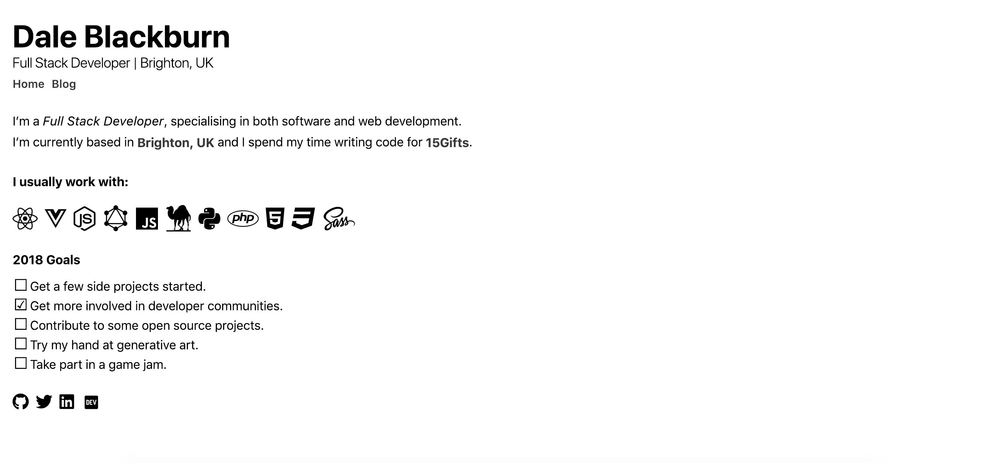

## Hello, 2019!

Last year I created a shiny new website, with the best intentions to share discoveries and pen down my thoughts. Sadly, I didn't manage to get any further than then [the initial one](/hello-world) that announced my new websites arrival. 

It seems that the only fitting thing to do now, having just rebuilt my website for the third time, is to write a new post of a similar ilk and go over the new build in a little detail.


## Previous Website

This is how the previous version looked:



The site was built using [Nuxt.js](https://nuxtjs.org/), the [Vue.js](https://vuejs.org/) equivalent of [Next.js](https://nextjs.org/), and was purposely simple and functional. I used the static site generator [Nuxtent](https://nuxtent.now.sh) to accomplish a simple document based blog and leaned into an acquired love of [brutalist web design](https://brutalist-web.design) for the look and feel.

I really enjoyed working on this site but I found that the resulting workflow felt a little sloppy and thrown together for the most part. This, coupled with the fact that I've been working with [React](https://reactjs.org/) more than Vue over last year, made me seek out some new tech to reduce the barrier to blogging, so I might find it easier to get myself writing regularly.

## Choosing Gatsby

What can I say about [Gatsby](https://gatsbyjs.org) other than that it is a dream to work with. After working on a few small Gatsby projects I found myself enamoured with the developer experience.

It provides just the right layer of abstraction, allowing you to easily provide data from any source, with it's integrated [GraphQL](https://graphql.org/) instance, tooling, and config driven development. 

It also provides you with a useful suite of components for routing, data querying, etc that makes developing your website a breeze.

Seeing as the resulting site itself is built in React, there are no real restrictions to what you can do with it, especially with the templating and plugin systems that make it all very easy to get started.

So, with these heart eyes for Gatsby in mind, you can see why it was a clear choice for me as the next iteration of my blog. 

## The New Website

With the new site, I wanted to carry over the general feel of the previous version, basic and brutalist, so I decided to again go with a monochrome palette and plain system fonts. This time however I chose to use two system fonts: 

```css
/* 
Headings are the same as before, using default system font variants 
*/
h1,h2,h3,h4,h5,h6 {
  font-family: -apple-system, BlinkMacSystemFont, Segoe UI, Roboto, Oxygen-Sans, Ubuntu, Cantarell, Helvetica Neue, sans-serif;
}

/* 
The body uses various system monospace variants, starting with Menlo
 */
body {
  font-family: Menlo, Monaco, Lucida Console, monospace, serif;
}
```

This made a subtle difference that breaks up the heavy body content from the headings a little better. 

The main shift in design is embedding the blog feed directly into the home page, moving the previous content into a fixed sidebar and opening up the doors to a single, load on demand list of posts. I built the layout using CSS grid, with some sensible mobile first fallbacks and I think it works rather well.

Changing over to React from Vue also allowed me to rethink my component structure and, after sketching out the layout in my notebook, the design provided a much simpler and clearer set of components to work with.

All in all, it's not a massively different site aesthetically but I'm happy with how it's turned out. I think the structure makes sense and I've really enjoyed working with Gatsby. It's definitely the platform I'll reach for any time I need to put a new site together going forward. 

## Hosting on Netlify

The previous version of my site was hosted using GitHub Pages, which has served me well for my hosting needs, but I felt it was time to move to something a little more robust for my next hosting and CI/CD solution.

[Netlify](https://netlify.com) is a fantastic service and, for the basic needs I have, completely free. I've recently used their [NetlifyCMS  Gatsby Starter](https://www.netlifycms.org/docs/start-with-a-template/) while building a website and it was a dream. If you need a CMS to go along with your Gatsby (or [Hugo](https://gohugo.io/) or [Middleman](https://middlemanapp.com/)) build, I'd recommend checking theirs out. It's perfect for providing a simple editor (both rich text and markdown), as well as auth and asset management, right out of the box. 

In general, I've found everything about Netlify's services and OSS to be incredibly considerate and well thought out, so it was a clear choice. 

As I prefer writing my markdown in [VSCode](https://code.visualstudio.com/) directly, using its side pane preview, I didn't need the CMS. So, having elected to simply control my blog post publishing via commits, I pointed Netlify to [the repo for this site](https://github.com/dakebl/dakebl.co.uk), set my deploy hook to rebuild the site on pushes to the `Master` branch, and here we are!

A fully automated static site pipeline and I couldn't be happier about it!