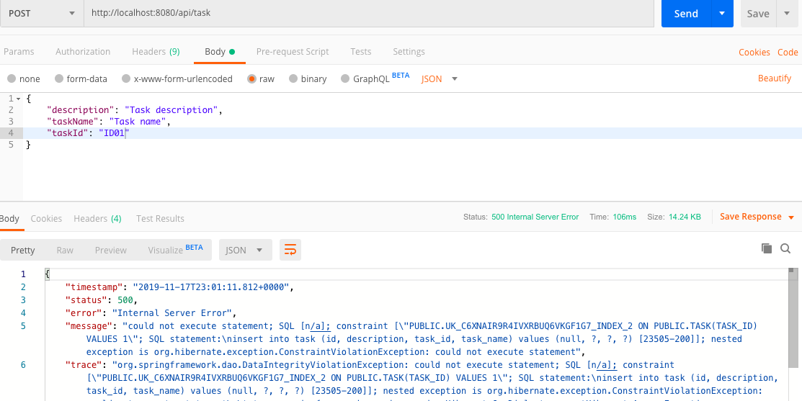

I'll try to explain step by step how to add a maintainable validation system to a simple Spring Boot project. Validation results we want to have when it's completely done like:

```json
{
  "description": "Task description is required"
}
```

Let's take a quick look at our spring boot application.

*Task Entity:*
```java
@Entity
public class Task {
    @Id
    @GeneratedValue(strategy = GenerationType.IDENTITY)
    private Long id;

    @NotBlank(message = "Task name is required")
    private String taskName;

    @NotBlank(message = "Task Id is required")
    @Size(min = 4, max = 5, message = "Please use 4 to 5 characters")
    @Column(updatable = false, unique = true)
    private String taskId;

    @NotBlank(message = "Task description is required")
    private String description;
    .
    .
    .(getter and setter)
```

*Task Service:*
```java
@Service
public class TaskService {

    @Autowired
    private TaskRepository taskRepository;

    public Task saveOrUpdateTask(Task task){
        return taskRepository.save(task);
    }
}
```

*Task Controller:*
```java
@RestController
@RequestMapping("/api/task")
public class TaskController {
    @Autowired
    TaskService taskService;

    @PostMapping("")
    public ResponseEntity<?> createNewTask(@RequestBody Task task){
        Task newTask = taskService.saveOrUpdateTask(task);
        return new ResponseEntity<Task>(newTask, HttpStatus.CREATED);
    }
}
```

And blank post request's response: *(used Postman)*


It contains meaningful words, but it is terrible.

We'll add `@Valid` annotation in post api and see the changes.

```java
    @PostMapping("")
    public ResponseEntity<?> createNewTask(@Valid @RequestBody Task task){
        Task newTask = taskService.saveOrUpdateTask(task);
        return new ResponseEntity<Task>(newTask, HttpStatus.CREATED);
    }
```

And again blank post request's response:


Yeah, it's going well but not enough.

We want this `field` + `defaultMessage` like `"description" : "Task description is required"`

for this purpose I'll use `BindingResult`in post api parameter. Shortly, BindingResult object is looks at the results and determined if the results have errors or success.

I'll show you the new code first and then explain it line by line.

*New Post Controller:*
```java
    @PostMapping("")
    public ResponseEntity<?> createNewTask(@Valid @RequestBody Task task, BindingResult result){
1.        if(result.hasErrors()){
2.            Map<String,String> errorMap = new HashMap<>();

3.            for(FieldError error: result.getFieldErrors()){
                errorMap.put(error.getField(),error.getDefaultMessage());
            }
4.            return new ResponseEntity<Map<String,String>>(errorMap,HttpStatus.BAD_REQUEST);
        }
        Task newTask = taskService.saveOrUpdateTask(task);
        return new ResponseEntity<Task>(newTask, HttpStatus.CREATED);
    }
```

1. : Check request's results, has errors if no error it'll create new task but if result has error something do.
2. : Use Map Collection for `Key-Value<String,String>` validations data.
3. : Result may have multiple errors, for that reason it loops every error and put errorMap that we create second step. error's type is `FieldError`and the object has getter and setter for field and message.
4. : return all errors that type of `Map<String,String>`


Again blank post request And...  that's exactly what we want. As I mentioned above `Key+Value`

You can create a Validation Service Layer and add this check and putting logic. In this way you can use this validation system in every controller/api by writing 2 lines code.

*Final Code in our create Task API: (You find the source code in end of the article.)*

```java
@PostMapping("")
    public ResponseEntity<?> createNewTask(@Valid @RequestBody Task task, BindingResult result){
        ResponseEntity<?> errorMap = validationService.ErrorService(result);
        if(errorMap!=null) return errorMap;

        Task newTask = taskService.saveOrUpdateTask(task);
        return new ResponseEntity<Task>(newTask, HttpStatus.CREATED);
    }
```
---

##Custom Exception Layer

But We have a problem. We've declared 'taskId must be unique' and this is work, can't create task that same taskId. The problem is error validations when try to create a task with an existing taskId. Returned error is



This is not what we want, You remember `Key+Value`.

The solution of this problem is a bit more complicated. We create own Exception Handler Layer. 

>***It may be a bit confusing at first but we will be able to use it again and again throughout our project.***

First of all we have to create 'exception' package and 3 classes under the this package.

**1. TaskIdException**
Here, Throw the error help of the class we inherited `RuntimeException`.

```java
@ResponseStatus(HttpStatus.BAD_REQUEST)
public class TaskIdException extends RuntimeException {

    public TaskIdException(String message) {
        super(message);
    }

```

**2. TaskIdExceptionResponse**
The class is sandwich layer that catches the error message returned from returning `TaskIdException`

```java
public class TaskIdExceptionResponse {
    private String taskId;

    TaskIdExceptionResponse(String taskId) {
        this.taskId = taskId;
    }

    public String getTaskId() {
        return taskId;
    }

    public void setTaskId(String taskId) {
        this.taskId = taskId;
    }
}
```

**3. CustomResponseExceptionHandler**
This is a `RestController`class that return `ResponseEntity` as a result of a bad http request.

Also declare `@ControllerAdvice` annotation for global controller management. 'It allows you to handle exceptions across the whole application, not just to an individual controller.' You can read more [on Medium](https://medium.com/@jovannypcg/understanding-springs-controlleradvice-cd96a364033f).

```java
@RestController
@ControllerAdvice
public class CustomResponseExceptionHandler extends ResponseEntityExceptionHandler {

    @ExceptionHandler
    public final ResponseEntity<Object> handleTaskIdException(TaskIdException ex, WebRequest request){
        TaskIdExceptionResponse exceptionResponse = new TaskIdExceptionResponse(ex.getMessage());
        return new ResponseEntity<>(exceptionResponse, HttpStatus.BAD_REQUEST);
    }
}
```

The `@ExceptionHandler` will try to find the specific exception(MyException) handler firstly, if not it will try to find the generic exception(Exception) [from stackoverflow](https://stackoverflow.com/questions/45636696/spring-exceptionhandler-behaviour).

---
Final part is update `TaskService`.

```java
public Task saveOrUpdateTask(Task task) {
        try {
            return taskRepository.save(task);
        } catch (Exception e) {
            throw new TaskIdException("Task ID '" + task.getTaskId() + "' already exist");
        }
    }
```
and final project is exactly what we want `Key+Value`


This method is awesome because we use again and again. Let's say we want to create api that find task by id. When called a task that does not exist we can throw custom exception like this.

```java
    public Task findTaskById(String taskId) {
        Project task = taskRepository.findTaskById(taskId);
        if (task == null) {
            throw new TaskIdException("Task ID '" + taskId + "'does not exist");
        }
        return task;
    }
```